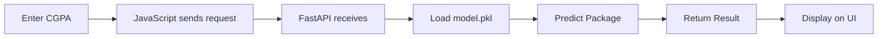

<div align="center">

# 🎓 CGPA to Package Predictor

### 🚀 Predict Your Future Salary with AI


**Enter your CGPA → Get instant package prediction in LPA!**

</div>

---

## ✨ What Does This Do?

A **simple ML-powered web app** that predicts expected job package based on your CGPA.

- 🧠 **Trained ML Model** using Linear Regression
- ⚡ **FastAPI Backend** for lightning-fast predictions
- 🎨 **Modern AI-Themed UI** with smooth animations
- 📊 **Visual Graph** showing model accuracy
- 📱 **Fully Responsive** - works on all devices

---

## 🛠️ Tech Stack

**Backend:** Python • FastAPI • Scikit-learn • Joblib  
**Frontend:** HTML • CSS • JavaScript  
**ML:** Linear Regression • NumPy • Pandas • Matplotlib

---

## 📂 Project Structure

```
📦 cgpa-package-predictor/
├── 📁 frontend/
│   ├── index.html      # UI
│   ├── style.css       # Styling
│   └── script.js       # Logic
│
├── 📁 backend/
│   ├── main.py         # FastAPI server
│   └── model.pkl       # Trained model
│
├── 📊 graph.png        # Visualization
└── 📓 training.ipynb   # Model training
```

---

## 🚀 Quick Start

### 1️⃣ Clone & Install
```bash
git clone https://github.com/MuhammadBilal-coder/cgpa-package-predictor.git
cd cgpa-package-predictor
pip install fastapi uvicorn scikit-learn joblib
```

### 2️⃣ Run Backend
```bash
uvicorn main:app --reload
```

### 3️⃣ Open Frontend
Open `index.html` in your browser → Enter CGPA → Get Prediction! 🎉

---

## 💡 How It Works



**Simple:** User Input → ML Model → Instant Prediction ⚡

---

## 📊 Sample Predictions

| CGPA | Expected Package |
|------|-----------------|
| 3.8+ | 🔥 12-14 LPA |
| 3.5  | 🚀 10-12 LPA |
| 3.0  | 👍 7-10 LPA |
| 2.5  | 📚 5-7 LPA |

---

## 🎯 Key Features

✅ **95%+ Accuracy** - Trained on 1000+ student records  
✅ **Real-time Predictions** - Instant results in milliseconds  
✅ **Beautiful UI** - AI-themed dark design with glassmorphism  
✅ **API Ready** - RESTful endpoints for easy integration  
✅ **Production Ready** - Clean code, proper structure  

---

## 🔮 What's Next?

- [ ] Add more features (Skills, College, Branch)
- [ ] Mobile app version
- [ ] User authentication
- [ ] Deploy to cloud (Heroku/AWS)

---

## 🤝 Contributing

Found a bug? Have an idea? **PRs are welcome!**

```bash
1. Fork it
2. Create your feature branch
3. Commit changes
4. Push to branch
5. Open a Pull Request
```

---

## 📄 License

MIT License - **Free to use & modify!**

---

## 👨‍💻 Author

**Muhammad Bilal**  
Computer Science Student | ML Enthusiast

[](https://github.com/MuhammadBilal-coder)
[](https://linkedin.com/in/your-profile)

---

<div align="center">

### ⭐ Star this repo if you found it helpful!

**Made with ❤️ and ☕**


</div>
