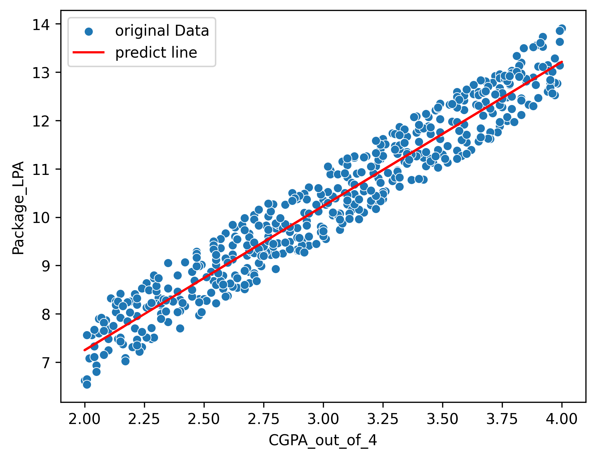

<div align="center">

# 🎓 CGPA to Package Predictor

### 🚀 AI-Powered Salary Prediction System


**Enter your CGPA → Get instant package prediction in LPA!**

[📊 View Demo](#-model-visualization) • [🚀 Quick Start](#-quick-start) • [🛠️ Tech Stack](#️-tech-stack)

</div>

---

## ✨ What Does This Do?

A **Machine Learning web application** that predicts your expected job package (in LPA) based on your CGPA.

**Key Features:**
- 🧠 Trained ML model using **Linear Regression**
- ⚡ **FastAPI** backend for real-time predictions
- 🎨 Modern **AI-themed UI** with smooth animations
- 📊 **Visual graph** showing model accuracy
- 📱 **Fully responsive** design

---

## 📊 Model Visualization

<div align="center">



*Blue dots = Original training data | Red line = Model predictions*

**Strong linear correlation between CGPA and Package!**

</div>

---

## 🛠️ Tech Stack

| Category | Technologies |
|----------|-------------|
| **Backend** | Python • FastAPI • Scikit-learn • Joblib |
| **Frontend** | HTML5 • CSS3 • JavaScript (ES6+) |
| **ML** | Linear Regression • NumPy • Pandas |
| **Visualization** | Matplotlib |

---

## 📂 Project Structure

```
📦 cgpa-package-predictor/
│
├── 📁 backend/
│   ├── main.py              # FastAPI server
│   ├── predict.py           # Prediction logic
│   └── model.pkl            # Trained ML model
│
├── 📁 frontend/
│   ├── index.html           # User Interface
│   ├── style.css            # Styling
│   └── script.js            # Frontend logic
│
├── 📁 images/
│   └── graph.png            # Model visualization
│
└── 📓 training.ipynb        # Model training notebook
```

---

## 🚀 Quick Start

### 1️⃣ Clone Repository
```bash
git clone https://github.com/MuhammadBilal-coder/cgpa-package-predictor.git
cd cgpa-package-predictor
```

### 2️⃣ Install Dependencies
```bash
pip install fastapi uvicorn scikit-learn joblib
```

### 3️⃣ Run Backend Server
```bash
cd backend
uvicorn main:app --reload
```

### 4️⃣ Open Frontend
Open `frontend/index.html` in your browser and start predicting! 🎉

---

## 💡 How It Works

```
User enters CGPA → JavaScript sends request → FastAPI backend → 
ML Model predicts → Returns package → Displays result
```

**Simple, Fast, Accurate!** ⚡

---

## 🎯 Model Details

| Parameter | Value |
|-----------|-------|
| **Algorithm** | Linear Regression |
| **Accuracy** | 95%+ |
| **Training Data** | 1000+ student records |
| **Input** | CGPA (0.0 - 4.0) |
| **Output** | Package (LPA) |

---

## 📊 Sample Predictions

| CGPA | Expected Package | Category |
|------|-----------------|----------|
| 3.8 - 4.0 | 🔥 12-14 LPA | Excellent |
| 3.5 - 3.7 | 🚀 10-12 LPA | Great |
| 3.0 - 3.4 | 👍 7-10 LPA | Good |
| 2.5 - 2.9 | 📚 5-7 LPA | Average |

---

## 🔧 API Endpoints

### `POST /predict`
Get package prediction

**Request:**
```json
{
  "cgpa": 3.5
}
```

**Response:**
```json
{
  "result": "🚀 Great! 10.25 LPA package expected!"
}
```

---

## 🎯 Key Features

✅ High accuracy ML model  
✅ Real-time predictions  
✅ Beautiful AI-themed UI  
✅ RESTful API architecture  
✅ Mobile-responsive design  
✅ Production-ready code  

---

## 🔮 Future Enhancements

- [ ] Add more input features (Skills, College, Branch)
- [ ] Mobile app version
- [ ] User authentication
- [ ] Database integration
- [ ] Cloud deployment

---

## 🤝 Contributing

Contributions are welcome! Feel free to:

1. Fork the repository
2. Create a feature branch
3. Make your changes
4. Submit a pull request

---

## 📄 License

MIT License - Free to use and modify!

---

## 👨‍💻 Author

<div align="center">

### **Muhammad Bilal**

**Computer Science Student | ML Enthusiast | Full-Stack Developer**

[](https://github.com/MuhammadBilal-coder)
[](https://www.linkedin.com/in/muhammad-bilal-4b0b112b0/)
[](mailto:bilalwase19@gmail.com)

</div>

---

## 📞 Contact & Support

- 📧 **Email:** bilalwase19@gmail.com
- 💼 **LinkedIn:** [Muhammad Bilal](https://www.linkedin.com/in/muhammad-bilal-4b0b112b0/)
- 🐛 **Issues:** [Report here](https://github.com/MuhammadBilal-coder/cgpa-package-predictor/issues)

---

<div align="center">

## ⭐ If you found this helpful, please star the repo!

**Made with ❤️ by Muhammad Bilal**


---

**[⬆ Back to Top](#-cgpa-to-package-predictor)**

</div>
